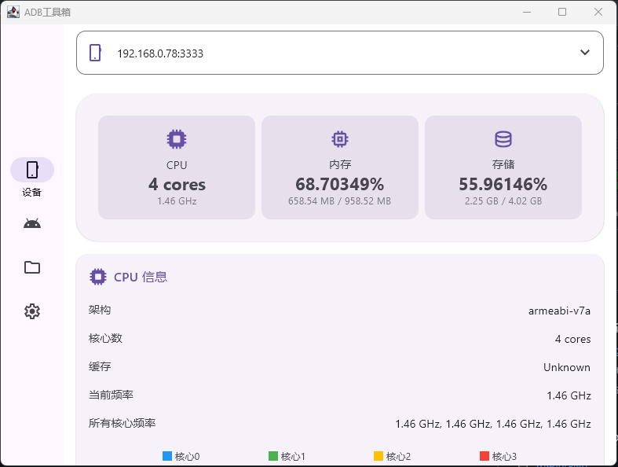

# ToolBox

ToolBox 是一个基于 Kotlin 和 Jetpack Compose Desktop 开发的跨平台桌面应用，用于管理和监控 Android 设备。

## 功能特性

- 设备管理：查看和管理已连接的 Android 设备
- 系统监控：
  - CPU 使用情况监控（频率、核心数等）
  - 内存使用监控
  - 存储空间监控
  - 电池状态监控
  - 网络状态监控
- 实时数据更新
- 美观的 Material 3 界面设计

## 项目截图

### 主界面


> 注：以上截图仅供参考，实际界面可能会随版本更新而变化。

## 技术栈

- Kotlin
- Jetpack Compose Desktop
- Material 3
- Koin (依赖注入)
- Kotlinx Serialization
- Android Debug Bridge (ADB)

## 系统要求

- Windows/macOS/Linux
- JDK 17 或更高版本
- Android 设备（用于监控）

## 构建和运行

1. 克隆项目
```bash
git clone [repository-url]
cd ToolBox
```

2. 构建项目
```bash
./gradlew build
```

3. 运行应用
```bash
./gradlew run
```

## 打包发布

项目支持以下格式的打包：
- Windows: MSI
- macOS: DMG
- Linux: DEB

使用以下命令进行打包：
```bash
./gradlew packageMsi  # Windows
./gradlew packageDmg  # macOS
./gradlew packageDeb  # Linux
```

## 开发说明

- 项目使用 Gradle 构建系统
- 使用 Koin 进行依赖注入
- 采用 MVVM 架构模式
- 使用 Jetpack Compose 构建现代化 UI

## 贡献

欢迎提交 Issue 和 Pull Request！ 